<https://gochiai.github.io/gochi_AI-2022ja/gochiusa.com/af/>
# mp3
<a href="https://gochiai.github.io/gochi_AI-2022ja/gochiusa.com/af/core_sys/images/others/bgm/af2022.mp3">bgm</a>  
<a href="https://gochiai.github.io/gochi_AI-2022ja/gochiusa.com/af/core_sys/images/others/voice01_Natsume.mp3">Natsume-1</a>  
<a href="https://gochiai.github.io/gochi_AI-2022ja/gochiusa.com/af/core_sys/images/others/voice02_Elu.mp3">Elu-2</a>  
<a href="https://gochiai.github.io/gochi_AI-2022ja/gochiusa.com/af/core_sys/images/others/voice03_Natsume.mp3">Natsume-3</a>  
<a href="https://gochiai.github.io/gochi_AI-2022ja/gochiusa.com/af/core_sys/images/others/voice04_Elu.mp3">Elu-4</a>  
<a href="https://gochiai.github.io/gochi_AI-2022ja/gochiusa.com/af/core_sys/images/others/voice05_Elu.mp3">Elu-5</a>  
<a href="https://gochiai.github.io/gochi_AI-2022ja/gochiusa.com/af/core_sys/images/others/voice06_Natsume.mp3">Natsume-6</a>  
<a href="https://gochiai.github.io/gochi_AI-2022ja/gochiusa.com/af/core_sys/images/others/voice07_Natsume.mp3">Natsume-7</a>  
<a href="https://gochiai.github.io/gochi_AI-2022ja/gochiusa.com/af/core_sys/images/others/voice08_Elu.mp3">Elu-8</a>  
<a href="https://gochiai.github.io/gochi_AI-2022ja/gochiusa.com/af/core_sys/images/others/voice09_Natsume.mp3">Natsume-9</a>  
<a href="https://gochiai.github.io/gochi_AI-2022ja/gochiusa.com/af/core_sys/images/others/voice10_Elu.mp3">Elu-10</a>  
<a href="https://gochiai.github.io/gochi_AI-2022ja/gochiusa.com/af/core_sys/images/others/voice11_Natsume.mp3">Natsume-11</a>  
<a href="https://gochiai.github.io/gochi_AI-2022ja/gochiusa.com/af/core_sys/images/others/voice12_Elu.mp3">Elu-12</a>  
<a href="https://gochiai.github.io/gochi_AI-2022ja/gochiusa.com/af/core_sys/images/others/voice13_Elu.mp3">Elu-13</a>  
<a href="https://gochiai.github.io/gochi_AI-2022ja/gochiusa.com/af/core_sys/images/others/voice14_Natsume.mp3">Natsume-15</a>  
<a href="https://gochiai.github.io/gochi_AI-2022ja/gochiusa.com/af/core_sys/images/others/voice16_Natsume.mp3">Natsume-16</a>  
# chino
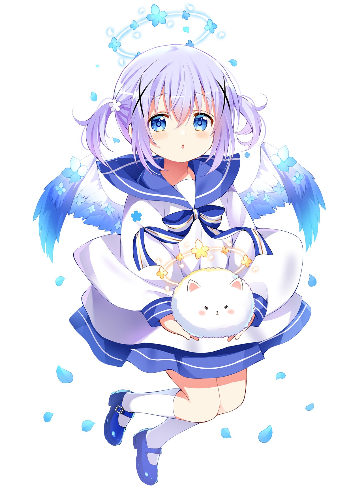
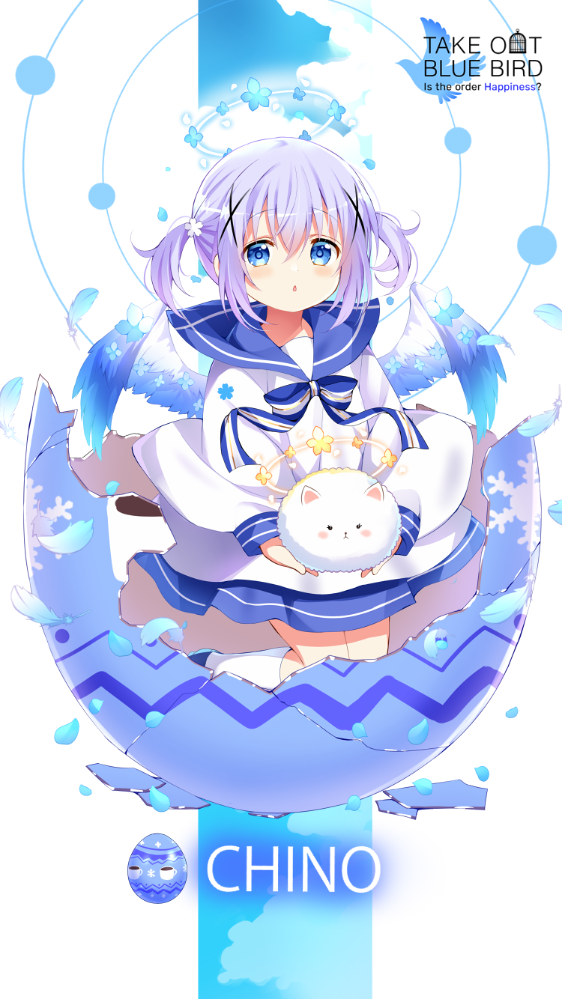
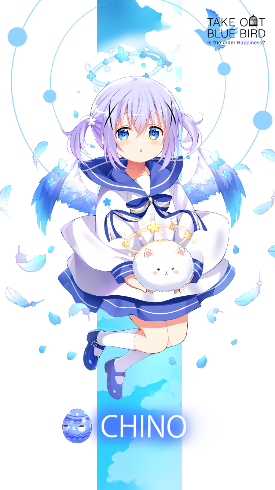

# cocoa

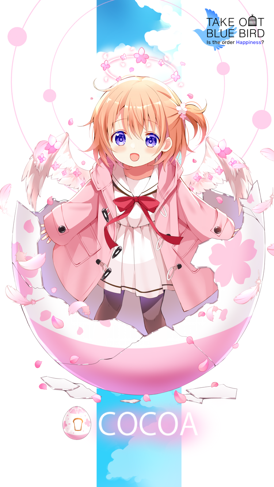
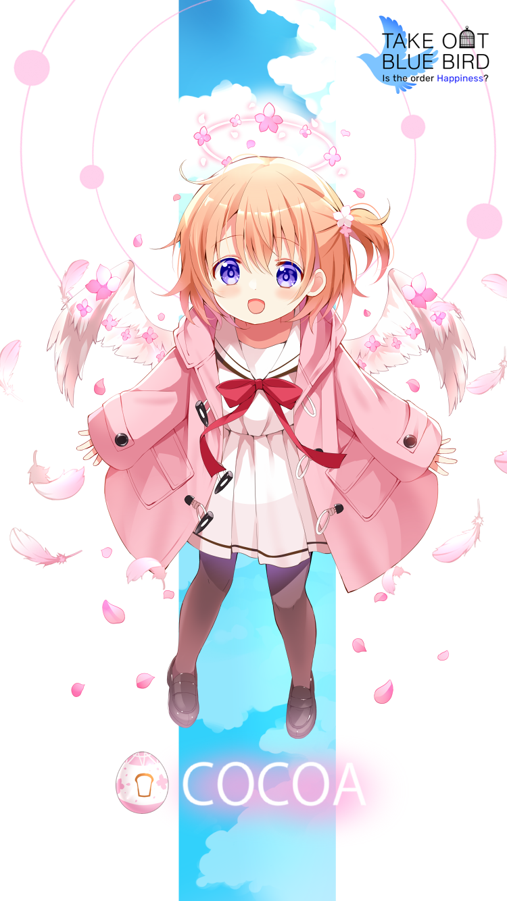

# rize
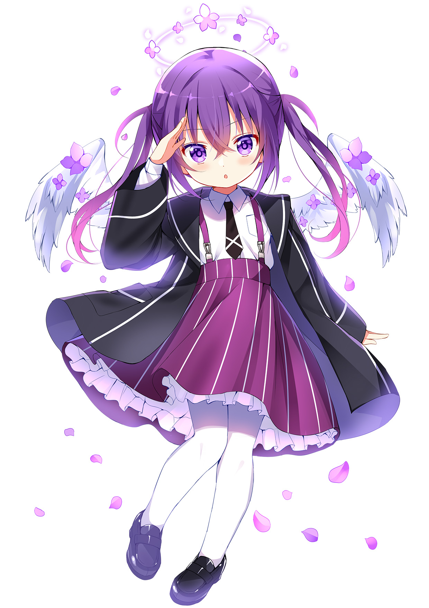
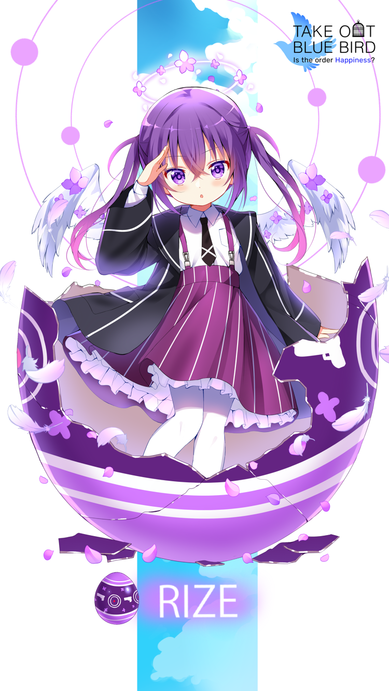
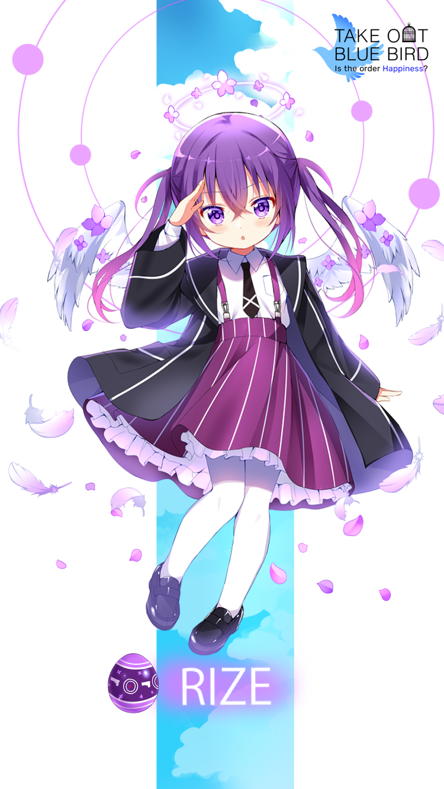

# maya

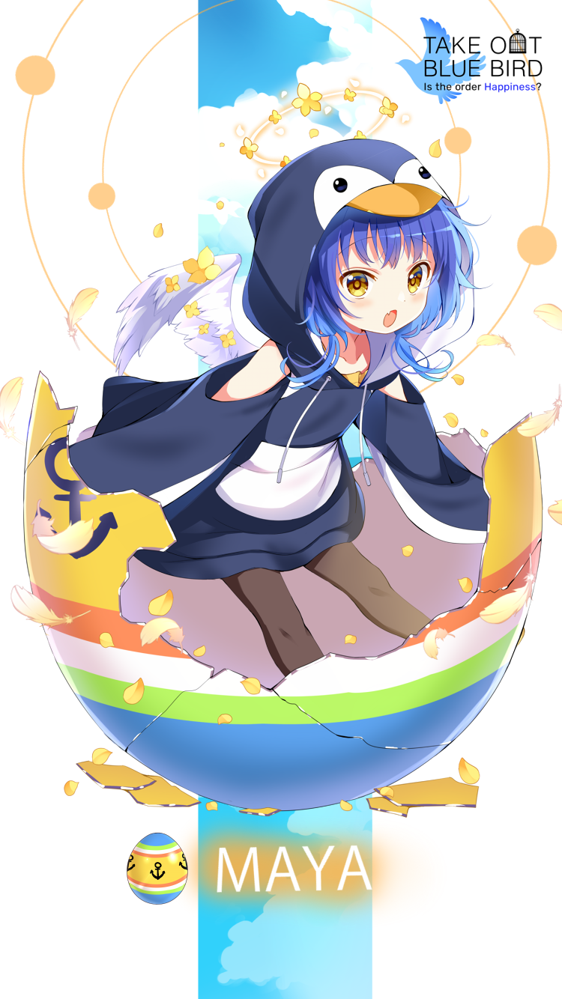
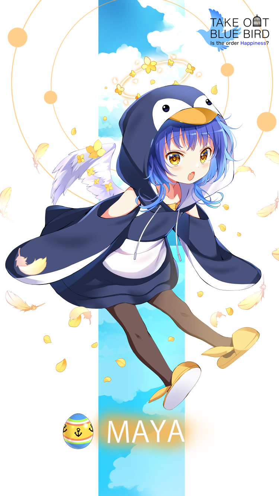

# megu

# syaro
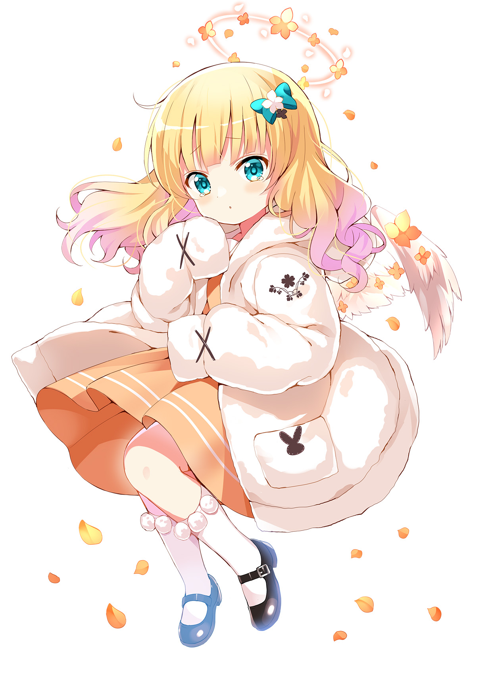
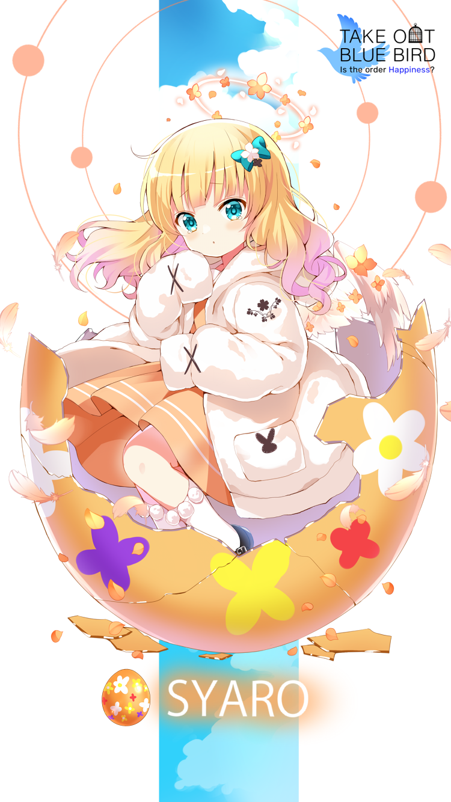
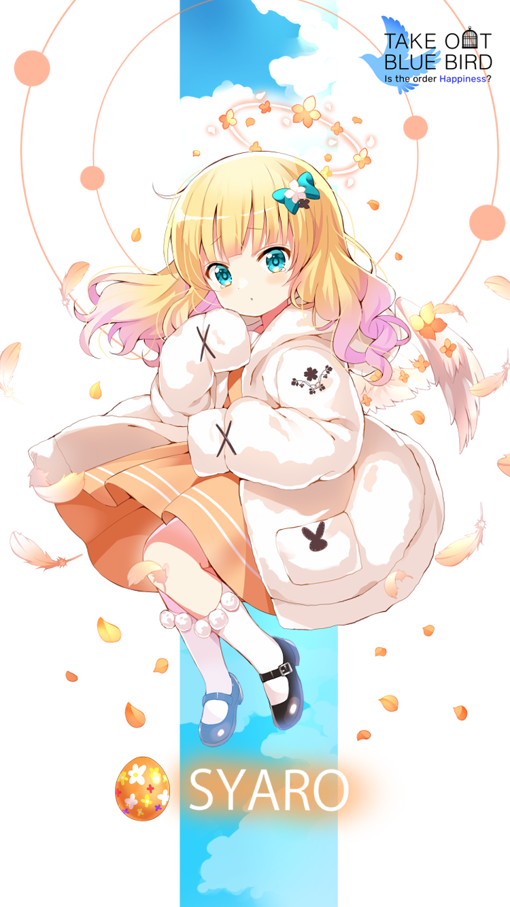

# chiya
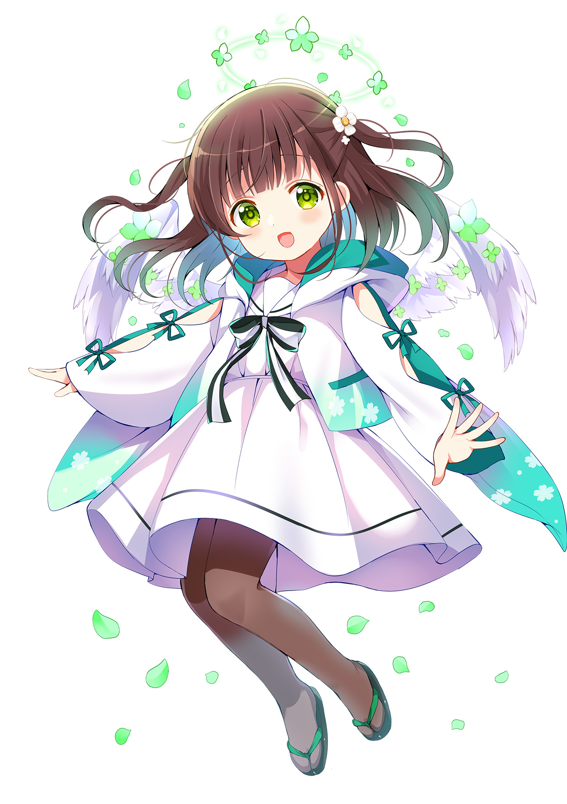
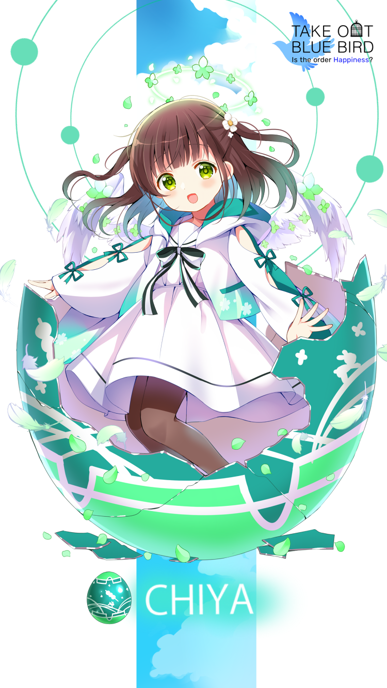
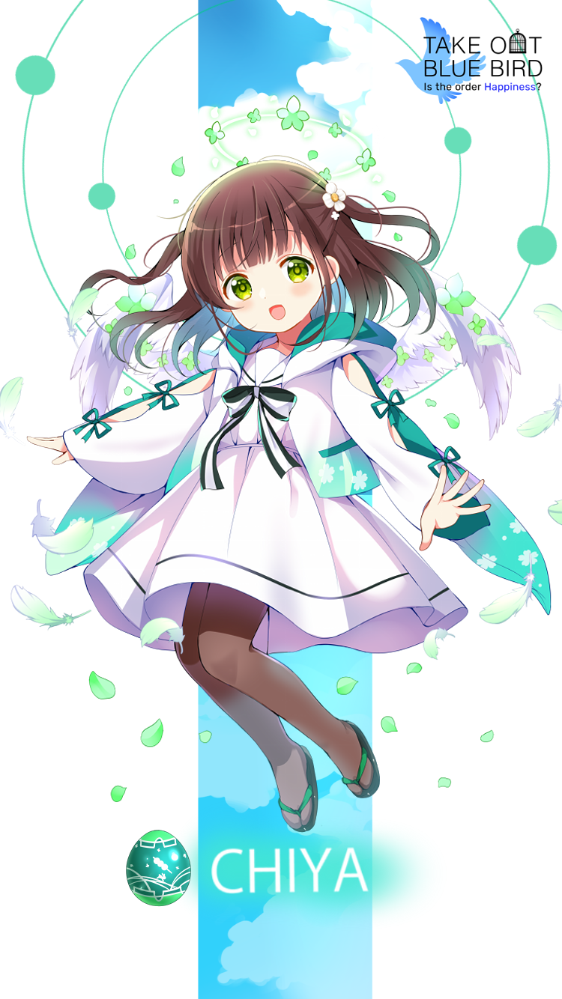

